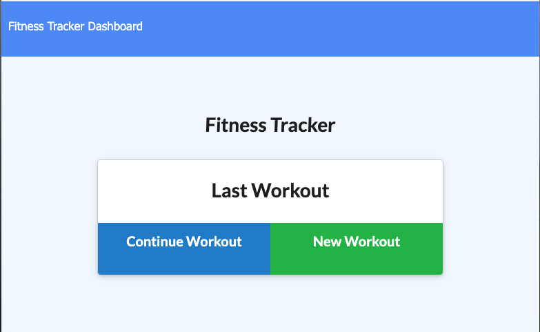

# TN-Fitness-Tracker

# Table Content
- [Description](#Description)
- [User Story](#User-Story)
- [Application Usage](#Application-Usage)
- [Link](#Link)
- [Screenshot](#Screenshot)

## Description
A consumer will reach their fitness goals more quickly when they track their workout progress.

## User Story
As a user, I want to be able to view create and track daily workouts. I want to be able to log multiple exercises in a workout on a given day. I should also be able to track the name, type, weight, sets, reps, and duration of exercise. If the exercise is a cardio exercise, I should be able to track my distance traveled.

## Application Usage
* Express
* mongoose
* morgan
* Robo 3T
* Heroku

## Link
* [Deployed Link](In-process)
* [Repo Link](https://github.com/trucn0215/TN-Fitness-Tracker)

## Screenshot
